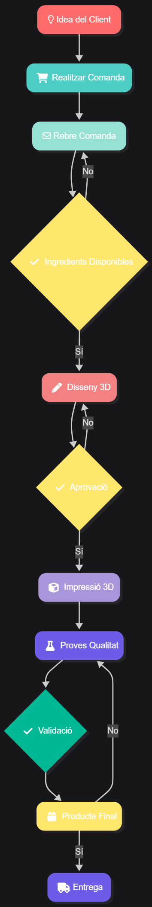

#  3Delicias

**Nom de l'equip:** 3Delicias

---

###  Autors
**Enzo Marin** i **Juan Morillas Cordani**

---

##  Context

L'empresa és una pastisseria especialitzada en la creació de postres i decoracions completament personalitzades mitjançant l'ús d'impressores 3D d'aliments. Aquest enfocament combina tècniques avançades de fabricació digital amb la tradició rebostera, permetent treballar amb ingredients comestibles per a donar forma a dissenys precisos, creatius i visualment impactants. El negoci integra art, innovació i gastronomia, oferint resultats que serien difícils d'aconseguir amb mètodes convencionals.

---

##  Objectiu

El propòsit principal és desenvolupar postres úniques i altament personalitzables aprofitant les possibilitats que brinda la impressió 3D. L'empresa busca fusionar creativitat, sabor i tecnologia per a elevar l'experiència del client, aportant solucions dolces innovadores que transformin la forma en què es conceben i gaudeixen els productes de rebosteria. Amb aquest enfocament, es pretén oferir elaboracions exclusives, adaptades als gustos i necessitats específiques de cada persona o esdeveniment.

---

##  Abast del projecte

| Aspecte | Descripció |
|---------|-----------|
|  **Disseny i modelatge** | Figures, decoracions i estructures comestibles mitjançant software compatible amb impressió 3D |
|  **Producció** | Postres personalitzats utilitzant impressores 3D d'aliments |
|  **Ingredients** | Selecció d'ingredients aptes per a l'extrusió i la impressió d'alta precisió |
|  **Prototips** | Creació de prototips, proves de textura i ajustos de qualitat |
|  **Personalització** | Per a esdeveniments (aniversaris, casaments, celebracions corporatives, etc.) |
|  **Producte final** | Presentació de productes finals llestos per a consum |

---

##  Diagrama de Procés

---

